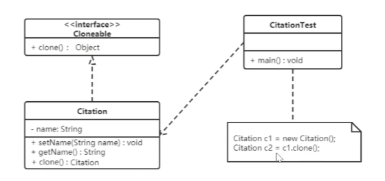

## 做题技巧
- 实线+空三角（泛化）：继承
- 虚线+空三角（泛化）：实现
- 实线+箭头（关联）：需要实参
- 虚线+箭头（依赖）：创建对象
- 实线+菱形（组合）：创建对象
- 实线+空菱形（聚合）：创建对象
- 存在protected，子模块一般要使用该对象，的方法
- 一般父类对象=new 子类对象
- 一般set方法存在赋值
- 一般get方法存在返回
- main中被创建的函数要么当实参使用，要么调用其方法
- 形参的对象一般要在方法中被使用，要么被直接使用，要么使用其方法（不然形参创建来干嘛）

## 依赖关系（临时关联，耦合性弱）
- 左慈（依赖）通过【-->】向其注入人物牌（被依赖），使用人物牌的技能发挥攻击防御作用，`通过传入实参，或者局部变量中，或静态方法调用人物牌`
- 此时人物牌（抽象类）是左慈的`一个属性`，还要对于这个属性写一个set方法，再写一个的方法（一般同名，好辨识功能），用于调用这个属性的方法（一般同名，好辨识功能）

## 关联关系：
- `单向关联`：A类下面有一个属性，这个属性来自（关联）->B类`一个A类对应多个B类，比如一个人可以有多个房子`
- `双向关联`：A类下面有一个属性，这个属性来自（关联）->B类，B类下面有一个属性，这个属性来自（关联）->A类
- `一个A类对应多个B类，同时一个B类对应多个A类，比如一个人可以和几个动物玩，一个动物也可以和几个人玩`

## 聚合关系（拿来主义）
- 学校【空菱形-】老师，学校不存在了，老师还存在
- 就像内存条，CPU相对于电脑，CPU单独不能运行，所以要作为电脑的一个属性
- `理解：聚合其实是一种对原功能的调用和叠加（可以按照自己的想法以不同的顺序调用原功能的各个方法），就像python调用库一样，对python来说不需要重复造轮子，调用就可以直接用`

## 组合关系
- 人【菱形-】手，人不在了，手也不在了

## 原则
- `开闭`：实现热插拔，可扩展，方法：`使用抽象类`（模版），这样抽象类（模版）就规定了所有方法，具体类实现了抽象类，相当于模版一样，仅存在内容不同
- `里式代换`：`子类尽量不要重现父类中的非抽象方法`，也就是父类的这个已经实现了的方法具有特殊意义，否则直接写成抽象不实现不就好了。在某个方法中，将子类直接代替父类
应该也可以达到同样的效果
- `依赖倒转`：`A类不应该依赖于B类（抽象类）的具体实现类，而应该A类依赖于B类（抽象类）`
- `接口隔离`：`接口/抽象类应该具有最少的功能`，比如安全门接口可以拥有防火，防水，防盗功能，但假设黑马安全门仅需防火防水功能，这个安全门接口就使用不了，所以安全门接口应该分成安全门接口1，安全门接口2，安全门接口3分别实现防火，防水，防盗功能，然后黑马安全门继承安全门接口1，安全门接口2，拥有防火，防水功能。上面如果安全门接口1多
了一个防盗功能，而白马安全门仅需防火功能，不需要防盗功能，那么白马安全门在继承安全门接口1时被迫继承了不需要的防盗功能。
- `最少知识`：`每个对象最好仅和与其存在聚合、组合、关联的对象发生相互调用，通过社会的互相关联关系与其他对象产生间接关联，降低耦合`
- `合成复用`：`先组合、聚合，其次继承`

## 创建者模式
### 原型模式（clone,复制）：
- 成员：`拥有clone方法的接口`,`实现该接口的对象类`,`访问类/main/测试类/client`
- 让一个接口具有一个复制自身的方法，然后让对象a实现该接口，当对象a去调用该方法时，会复制一个对象a，原对象a就是原型。
- 浅克隆：非基本类型属性（如自定义的类）不克隆，和原型使用同一套（在内存上）
- 深克隆：全部克隆，使用的都不是同一套，只是长的一模一样。
- 通过clone创建的对象和通过new创建的对象不同，不会去执行构造方法
- `案列`：
- `使用场景`：对象创建很复杂；想按照自己的想法创建对象（`实质就是自定义一个clone方法，包含了new`）
- 

### 建造者模式（主要是单一职责/接口隔离）（开闭）
- 成员：`规定要组装哪些部件的抽象Builder类`,`实现该Builder类的Builder对象类`,`实现具体Builder对象类的Director对象类并决定组装：对Builder类的构建方法排序`,`Builder对象类要创建的product类（依赖关系）`，`访问类/main/测试类/client`
- 让同样的`构建`过程（CPU，内存组装成电脑的方式）`创建/装配`不同的表示（不同的电脑级别）
- Builder负责选取构建部件，Director负责组装（Builder构建每一个部件都是一个方法，组装就是用不同的顺序调用这些方法）
- `使用场景`：适用于同类的建造者，原本都是组装车，那么可以是组装不同牌子的车，但是不能突然插入（热插拔）一个组装电脑，这个时候已经不是改变组装顺序，选择不同部件牌子能搞定的了
- `案列`：
抽象Builder类规定要构建`product类具体对象车的车座`，`product类具体对象车的车架`...，以及`返回product`；
如摩拜、哈喽Builder对象继承并实现了抽象Builder类；
Director对象类`聚合`Builder类，并拥有组装product的方法（`在Builder类功能的基础上再叠加一个功能：在调用Builder类的功能同时并加入调用功能的顺序`）
- 
- 

## 结构型模式
### 适配器模式（HDMI转DP的转换器）
#### 类适配器（继承）
- 成员：`目标接口/抽象类（DP口）`，`适配者类（HDMI口）`，`适配器类（HDMI转DP）`
- `继承适配者类（HDMI口），并实现目标接口（DP口），此时同是适配者类和目标接口的子类`：因此本质是一个HDMI口，但却拥有了DP口的方法，这样就可以实现屏幕--HDMI口--DP口--电脑。对于电脑来说，当电脑向屏幕传送携带RGB和DP的信息时，调用了DP口的方法，但DP口的方法里面却可以调用HDMI的方法去真正实现。因此实现了转换。
--`使用场景`：必须一个是抽象类，另一个是接口，如果两个都是类，但是却因为不能同时继承两个类而无法做到。
- 
- 

#### 对象适配器（聚合/组合/引用）
- `不同之处`：将上面的继承改为聚合
- 成员：`目标接口/抽象类（DP口）`，`适配者类（HDMI口）`，`适配器类（HDMI转DP）`
- `案列`：屏幕--HDMI口--DP口--电脑。对于电脑来说，当电脑向屏幕传送携带RGB和DP的信息时，调用了DP口的方法，但DP口的方法里面却可以调用HDMI的方法（聚合的手法，将适配者类作为私有属性）去真正实现。因此实现了转换。
- 
- 

### 装饰者模式（HDMI转DP的转换器）
- 成员：
`规定主菜的抽象类`，`实现主菜的具体类`，
`规定配菜的抽象类（抽象装饰者）并聚合和继承（规定主菜的抽象类）`，`实现配菜的具体类`
- 
- `案列`：
主菜：炒饭、炒面。
配菜：鸡蛋、培根。
配菜的抽象类中聚合了主菜的抽象类，那么其实和这个配菜搭配的主菜对于这个配菜来说，搭配主菜才是配菜。也就是配菜自己把自己当主菜使了。因为如果不点配菜，那么就正常实现主菜的抽象就好了。如果要点配菜，那么一般肯定是存在主菜的，那么其实就是n个配菜+1个主菜。先实现第一个配菜后，得到1个配菜+一个主菜。然后再实现第2个配菜， 传入主菜=上一次实现的的1个配菜+一个主菜，得2个配菜+一个主菜。`类似套娃`。
- 
- 

### 桥接模式
- `案例`:
对于一个跨平台播放器来说，需要考虑两个方面，一方面是平台windows/mac，一方面是视频格式RMVB/AVI。因此，将其中一个方面作为主方面，其余方面作为辅助方面，然后主方面抽象类聚合辅助方面的抽象类/接口。windows/mac（`扩展抽象化角色refined abstration`）实现主方面抽象类（`抽象化角色abstration`），RMVB/AVI（`具体的实现化角色concreate implementor`）实现辅助方面的抽象类/接口（`实现化角色implementor`）。
- `不同之处`：这个主方面的聚合代码中，对聚合的接口，实现的是protected，而不是privated。此时子类可以调用父类聚合的类，只需想办法让【父类聚合的类】通过子类的super传给父类。此时，子类和父类都可以调用父类中的【聚合的类】，子类是因为父类的protected属性才做到的。
- `使用场景`：如果出现两个维度（多个）一旦其中一个维度扩展，就会增指数增长的情况。
- 

### 外观模式
- '成员'：外观角色（Facade），子系统角色（sub system）
- '案例'：
实质就是封装，类似函数封装，比如泡茶，要先洗茶叶，洗茶杯...等一系列操作，而此时可以将这些操作封装到一个函数中，只需要调用这个函数就可以统一实现。同理，这里用外观角色（Facade）作为函数，子系统角色（sub system）作为洗茶叶，洗茶杯...等一系列操作。只需要用外观角色（Facade）聚合子系统角色（sub system），然后外观角色（Facade）实现一个泡茶方法，这个方法再调用子系统角色（sub system）即可。
- `使用场景`：内部结构复杂

### 组合模式
- '成员'：抽象根节点（component），树枝节点（composite），叶子节点（leaf）
- 案例
对于一个如菜单，有早餐，正餐两种，早餐有包子，豆浆。正餐有水煮鱼，牛蛙。这种可以用树结构表示。
其中抽象根节点如果同时集合了树枝节点（composite），叶子节点（leaf）的方法，则是透明模式，一般使用这种模式，但是这种模式对于叶子节点（leaf）来说存在用不到的方法，因此在实现用不到的方法的时候一般存在return false/null。否则则是安全模式，一般不用。
同时，因为会被多继承，因此将子类都会用到的privated统一在父类中以protected定义，这样多个子类中就不用重复定义了，而且还都可以使用。
树枝节点（composite）主要是抽象根节点的实现，因此菜单，早餐，正餐这种类似文件夹可包括的形式都以该类实现。
同时创建一个列表，用于存储文件夹，因为列表可能接受文件夹，也可能接受文件，此时直接将列表定义为抽象根节点，因为这两个都继承抽象根节点，因此列表可以接收文件夹，也可以接收文件。并聚合抽象根节点，只有这样才可以添加文件夹，而不是只能添加文件。
而叶节点虽然也继承了抽象根节点，但主要是为了实现一个独特的功能。
- `使用场景`：可用于树类型的都可以用组合模式，专为树模式的递归发明出的模式

java状态模型设计思想：
- 1、需要一个中间人，只需要通过中间人就可以完成不限量的操作
- 2、这个中间人不能改变，否则控制中间人就很得跟着改很多
- 3、在状态模型这里，中间人应该拥有两种功能，设置状态和获取状态，并且尽量代码少，只负责简单调用，具体操作由具体状态类负责执行
- 4、设置状态其实就是让中间人临时代替一个具体状态，就像三国杀里面的左慈使用人物牌
- 5、而获取状态则相当于在使用指定人物牌后再使用了这个人物牌的技能
- 6、状态类则相当于一个人物牌模型，而且是写好了几个不同的状态类，即写好了不同的几个人物牌，状态类应该至少拥有使用中间人的设置状态的功能，因为“我们”就是状态类，或者说人物牌，这是一个重要的理念，假如说在一个围棋局中，应该有黑棋，白棋，棋盘，黑方下棋者，白方下棋者这五方，但是其实黑方下棋者就是黑棋，白方下棋者就是白棋，那么实际上仅有黑棋，白棋，棋盘这三方。
- 7、上面有一种人就是棋的思想。其实还是有5方，但是依靠上面这个功能做到了5方变3方。
- 8、每个状态都有这个功能，这个功能就是接口。
- 9、至于人物还有没有专属技能，这个无所谓，可任意存在。
- 10、既然人即是棋，那么直接控制棋做出操作不就好了，为什么要把棋交给中间人，然后我们再通过控制中间人控制棋，即把3方变成了5方呢？主要是为了使让人物牌全部放在一起，并且和使用分离，使管理代码，增加功能都更方便，也就是解耦。
- 11、并且要注意状态类至少拥有使用中间人的设置状态的功能，这个功能不仅能设置将自己作为左慈的牌，也能设置别人作为别人的牌，如果设置别人，那么此时可以在控制中间人设置状态功能旁边加一个专属代码，使自己技能得到使用，然后设置别人作为左慈的牌，相当于即使用了自己技能又同时转换了人物牌
- 12、上面这个功能是一种针对条件语句判断的功能，比如每年根据步数判定会员，如果去年是金牌，但是今年一步不跑，那么先进入金牌对象，看看能不能维持金牌还是进入银牌，在银牌对象继续判断是升为金牌，维持银牌，还是掉为铜牌，如果进入铜牌，再判断升银牌，维持铜牌，还是进入无牌。就是可以看到他这种方式不是一次到位，而是每个牌仅需完成自己的事情即可，而不是多重组合。比如说A条件进入1，B条件进入2，AB条件进入3，这样A、B对应了1、2、3。浪费了。按照上面这种方法，A、B可以仅对应1、2。

java建造者模型（生成器模型）设计思想：
1、
